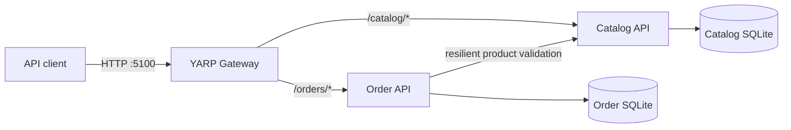

# Commerce Microservices

Commerce Microservices is a portfolio-scale .NET 8 backend that demonstrates
clear service boundaries, synchronous service-to-service communication,
resilience, request tracing, dependency-aware health checks, integration
testing, and containerized delivery.

The project models a compact commerce workflow: Catalog owns product details,
prices, and stock; Order owns customer orders and historical item snapshots; a
YARP gateway provides one public entry point. It is designed as an architecture
demonstration and local development system—not as a claim of production
deployment.

## Author and portfolio purpose

This project was designed and implemented by Endrina Berbatovci as a backend
architecture and microservices portfolio project.

## Architecture



Catalog and Order own separate databases. During order creation, Order asks
Catalog for authoritative product data and stock, then stores the product name
and price as a historical snapshot. More detail and a request-flow diagram are
available in [docs/architecture.md](docs/architecture.md).

## Technology stack

- .NET 8 and C# 12
- ASP.NET Core Minimal APIs
- Entity Framework Core with SQLite
- YARP reverse proxy
- Swashbuckle Swagger/OpenAPI
- `Microsoft.Extensions.Http.Resilience` standard resilience handler
- ASP.NET Core health checks and Problem Details
- xUnit with `WebApplicationFactory`
- Docker, Docker Compose, and GitHub Actions

## Services and ports

| Service | Local port | Responsibility | Development URL |
| --- | ---: | --- | --- |
| Gateway API | 5100 | Public routing and downstream aggregation | `http://localhost:5100` |
| Catalog API | 5101 | Products, prices, and stock | `http://localhost:5101/swagger` |
| Order API | 5102 | Orders, item snapshots, totals, and status | `http://localhost:5102/swagger` |

Container-internal traffic uses port 8080. The existing port mappings are
defined in `docker-compose.yml`.

## Run locally with Docker

Requirements: Git and Docker Desktop.
Clone the [repository](https://github.com/EBerbatovci/commerce-microservices.git)
and enter its nested project directory:

```bash
git clone https://github.com/EBerbatovci/commerce-microservices.git
cd commerce-microservices/commerce-microservices
docker compose up --build
```

In another terminal, confirm readiness:

```bash
docker compose ps
```

All three containers should report `healthy`. Open:

- Gateway overview: `http://localhost:5100`
- Catalog Swagger: `http://localhost:5101/swagger`
- Order Swagger: `http://localhost:5102/swagger`
- Gateway readiness: `http://localhost:5100/health/ready`

Stop the stack without deleting data:

```bash
docker compose down
```

Use `docker compose down -v` only when you intentionally want to delete the two
SQLite volumes.

## Run without Docker

Requirements: .NET 8 SDK. From three terminals in the project directory:

```bash
dotnet run --project src/Catalog.API
```

```bash
dotnet run --project src/Order.API
```

```bash
dotnet run --project src/Gateway.API
```

## API examples

Create a product through the gateway:

```bash
curl -i -X POST http://localhost:5100/catalog/api/products \
  -H "Content-Type: application/json" \
  -d '{
    "name": "USB-C Dock",
    "description": "Docking station for a development workspace.",
    "price": 149.99,
    "stock": 8
  }'
```

Use the returned product ID to create an order:

```bash
curl -i -X POST http://localhost:5100/orders/api/orders \
  -H "Content-Type: application/json" \
  -H "X-Correlation-ID: portfolio-demo-001" \
  -d '{
    "customerEmail": "customer@commerce.dev",
    "items": [
      {
        "productId": "REPLACE_WITH_A_CATALOG_PRODUCT_ID",
        "quantity": 1
      }
    ]
  }'
```

Clients never supply product names or prices to Order. See
[docs/api-examples.md](docs/api-examples.md) and
[CommerceMicroservices.http](CommerceMicroservices.http) for more examples.

## Public gateway routes

| Method | Route | Success | Common errors |
| --- | --- | ---: | --- |
| GET | `/catalog/api/products` | 200 | — |
| GET | `/catalog/api/products/{id}` | 200 | 404 |
| POST | `/catalog/api/products` | 201 | 400 |
| PUT | `/catalog/api/products/{id}` | 200 | 400, 404 |
| DELETE | `/catalog/api/products/{id}` | 204 | 404 |
| GET | `/orders/api/orders` | 200 | — |
| GET | `/orders/api/orders/{id}` | 200 | 404 |
| POST | `/orders/api/orders` | 201 | 400, 503 |
| PATCH | `/orders/api/orders/{id}/status` | 200 | 400, 404 |
| DELETE | `/orders/api/orders/{id}` | 204 | 404 |

Errors use `application/problem+json` without exposing stack traces.

## Testing and continuous integration

Run all integration tests in the .NET 8 SDK container:

```bash
docker build -f Dockerfile.tests -t commerce-microservices-tests . && docker run --rm commerce-microservices-tests
```

Or run with a locally installed .NET 8 SDK:

```bash
dotnet restore CommerceMicroservices.sln
dotnet build CommerceMicroservices.sln --configuration Release --no-restore
dotnet test CommerceMicroservices.sln --configuration Release --no-build
```

The tests use isolated temporary SQLite databases. Order tests mock Catalog's
HTTP transport and never require running containers. The GitHub Actions workflow
runs restore, build, tests, Compose validation, and all production image builds
on pushes and pull requests to `main`. See [docs/testing.md](docs/testing.md).

## Resilience and request tracing

Order-to-Catalog calls use two short retries for transient transport failures,
HTTP 408, HTTP 429, and HTTP 5xx responses. Attempts time out after two seconds,
the entire operation after five seconds, and repeated failures open the circuit
for 15 seconds. HTTP 400 and 404 responses are not retried. Unavailable Catalog
dependencies produce HTTP 503 during order creation.

Every service accepts an existing `X-Correlation-ID` or generates a GUID. The
identifier is returned in every response and included in structured log scopes.
Gateway forwards it downstream, and Order propagates it to Catalog.

## Health monitoring

All health responses are JSON with an overall status, service name, and named
dependency statuses.

| Endpoint | Purpose | Dependency behavior |
| --- | --- | --- |
| `/health/live` | Process liveness | Application check only |
| `/health/ready` | Traffic readiness | Includes databases and downstream services |
| `/health` | Compatibility alias | Same checks as readiness |

Catalog readiness checks its SQLite database. Order checks SQLite and Catalog.
Gateway checks both downstream APIs. Docker Compose health checks use readiness.

## Project structure

```text
.
├── .github/workflows/ci.yml
├── docs/
│   ├── api-examples.md
│   ├── architecture.md
│   └── testing.md
├── src/
│   ├── Catalog.API/
│   ├── Gateway.API/
│   └── Order.API/
├── tests/
│   ├── Catalog.API.Tests/
│   └── Order.API.Tests/
├── docker-compose.yml
├── Dockerfile.tests
└── CommerceMicroservices.sln
```

## Design decisions

- **Independent data ownership:** each domain service has its own SQLite store.
- **Snapshot pricing:** existing orders remain historically meaningful when a
  catalog product changes.
- **Synchronous validation:** straightforward HTTP makes the consistency and
  failure tradeoffs visible in a compact demo.
- **Gateway boundary:** external clients use stable route prefixes while domain
  APIs stay independently runnable.
- **Realistic integration tests:** public HTTP behavior and persistence are
  exercised without external infrastructure.

## Current limitations

This portfolio project does not yet include authentication or authorization,
TLS termination, rate limiting, distributed tracing export, centralized logs,
database migrations, stock reservation/decrement, asynchronous messaging, or a
production secret store. SQLite and synchronous validation are deliberate local
demo choices, not recommendations for every production workload.

## Future improvements

- JWT authentication and role-based authorization
- OpenTelemetry traces, metrics, and centralized structured logs
- Asynchronous order events and eventual-consistency workflows
- Transactional stock reservation with idempotency support
- EF Core migrations and a production-oriented relational database
- Rate limiting, API versioning, and contract tests

Security reporting guidance is available in [SECURITY.md](SECURITY.md).

## Copyright and usage

Copyright © 2026 Endrina Berbatovci. All rights reserved.

This repository is publicly available for portfolio review and technical
evaluation. Public availability does not grant an open-source license.
No permission is granted to reuse, modify, redistribute, sublicense, or use
this work commercially without prior written permission.
