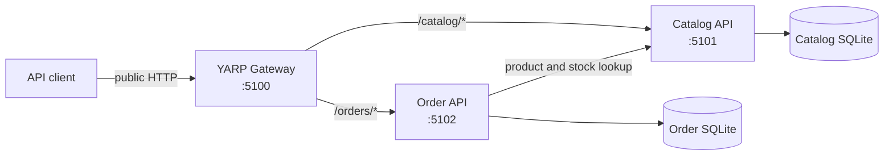
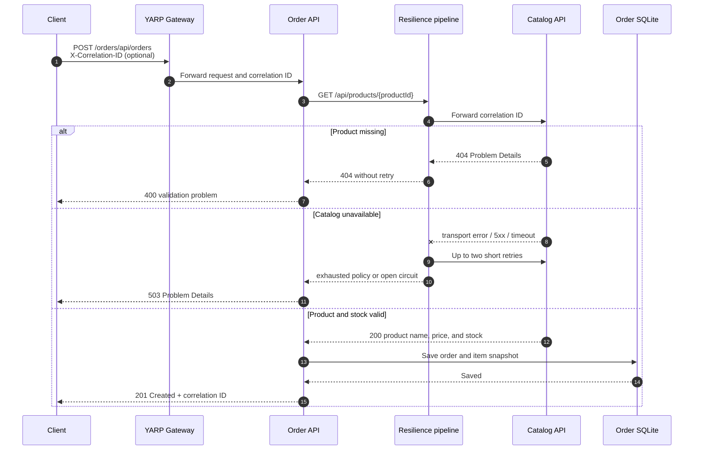
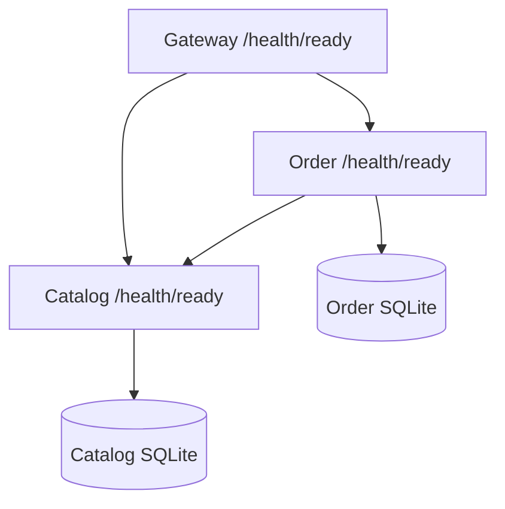

# Architecture

Commerce Microservices separates catalog, ordering, and edge-routing concerns
into independently runnable .NET 8 services. This is a portfolio architecture
demonstration intended for local execution and technical discussion.

## System context

| Service | Owns | Does not own |
| --- | --- | --- |
| Catalog API | Product descriptions, prices, and available stock | Orders and customer data |
| Order API | Orders, item snapshots, status, and totals | Authoritative product inventory |
| Gateway API | Public route prefixes and downstream forwarding | Domain data and business rules |

Each service owns its persistence. There are no cross-database queries or shared
EF Core entities.

## Order creation request flow

Order snapshots Catalog's current name and price. Historical orders therefore
remain stable when a product is later renamed or repriced. Duplicate product
lines are aggregated for stock validation.

## Failure handling and resilience

Order's typed Catalog client uses the .NET 8 standard resilience handler:

- up to two retries with a short jittered delay;
- retries only for transport failures, HTTP 408, HTTP 429, and HTTP 5xx;
- no retries for HTTP 400 or 404;
- a two-second per-attempt timeout and five-second total timeout;
- a circuit breaker that opens for 15 seconds after the configured failure
  threshold is met.

The API translates exhausted dependency failures and open-circuit errors into
HTTP 503. Validation failures use HTTP 400. Central exception handlers log
unexpected errors and return generic `application/problem+json` responses
without stack traces.

## Request tracing

Catalog, Order, and Gateway use the same correlation contract:

1. Accept `X-Correlation-ID` when supplied, otherwise generate a GUID.
2. Store it as the ASP.NET Core trace identifier.
3. add it to a structured logging scope;
4. return it on every response;
5. forward it through Gateway and from Order to Catalog.

This creates a searchable request key across service logs without requiring a
specific observability backend.

## Health model

| Probe | Meaning | Included checks |
| --- | --- | --- |
| `/health/live` | The application process can execute requests | Application only |
| `/health/ready` | The service can receive application traffic | Local persistence and required downstream services |
| `/health` | Backward-compatible readiness alias | Same as `/health/ready` |

Every response contains `status`, `service`, and named `dependencies`. Docker
Compose waits for Catalog readiness before Order, and for both before Gateway.

## Testing boundaries

Integration tests start Catalog and Order in memory using
`WebApplicationFactory`. Each factory uses a unique temporary SQLite database.
Order replaces Catalog's network transport with a deterministic handler, which
tests success, validation, propagation, retries, and unavailability without a
running Catalog container.

## Deliberate constraints

SQLite keeps local setup small but is not presented as a universal production
database choice. The synchronous Catalog check demonstrates resilience clearly,
but it does not reserve or decrement stock and cannot guarantee inventory across
concurrent orders. Authentication, distributed telemetry export, asynchronous
events, and production secret management remain future work.
